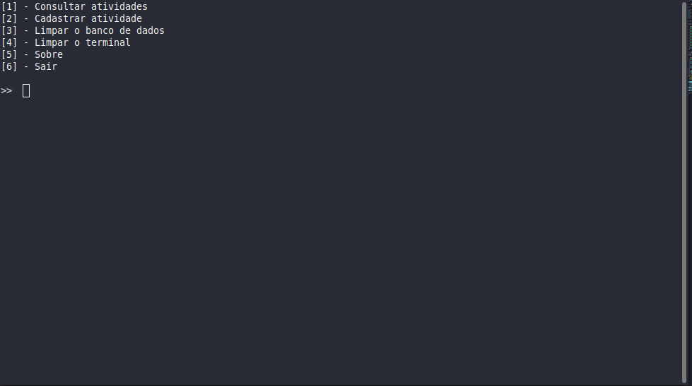

<h1 align="center">📅 agen</h1>

<p align="center">
    
    &nbsp;&nbsp;
    &nbsp;&nbsp;
    
</p>

<p align="center">
    <a href="#">Tecnologias</a>&nbsp;&nbsp;&nbsp;|&nbsp;&nbsp;&nbsp;
    <a href="#">Projeto</a>&nbsp;&nbsp;&nbsp;|&nbsp;&nbsp;&nbsp;
    <a href="#">Instalação</a>&nbsp;&nbsp;&nbsp;|&nbsp;&nbsp;&nbsp;
    <a href="#">Tecnologias</a>&nbsp;&nbsp;&nbsp;|&nbsp;&nbsp;&nbsp;
    <a href="#">Licença</a>
</p>

## 💻 About the Project

`Agen` is an agenda via the terminal, when you register a new activity the information is saved in an external notepad, that is, even if you close the terminal or turn off your machine, the information is still saved.

This project was developed as a study base, I just did it for fun but I hope you like it :)


## How To Use 🔧
---

From your command line, first clone Simplefolio:

if you don't have ruby installed type
```bash
sudo apt-get install ruby-full
```

```bash
# Clone this repository
$ git clone https://github.com/lietsondossanto/agen

# Go into the repository
$ cd agen

# give execution permission
chmod +x app.rb

# run
$ ruby app.rb
```

<h2>Image</h2>



## 🚀 Technology

- Ruby

## Author

- **Lietson dos santos** - [https://github.com/lietsondossanto](https://github.com/lietsondossanto)

## License 📄

This project is licensed under the MIT License - see the [LICENSE.md](LICENSE.md) file for details

[](https://twitter.com/https://twitter.com/lietsondossanto) [](mailto:lietsondossanto@gmail.com)
